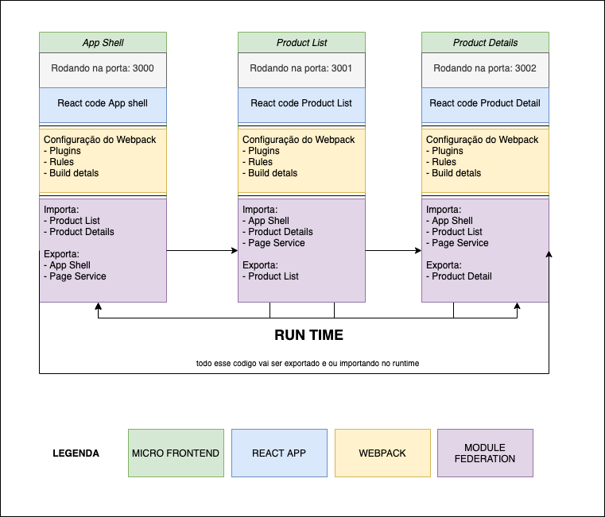

## Micro-Front-Ends com Webpack5 Module Federation

Neste projeto foi utilizado o plugin de module Federation do webpack
para criar nossos Micro-Front-Ends. O module federation é responsável por criar essa integração entre vários builds separados,
com ele, é possível compartilhar código(componentes, lógica, serviços, etc ...) em tempo de execução 🤯, e ao mesmo tempo manter
seu processo de construção e desenvolvimento em paralelo.

## Aplicação Final 🎬


Observe aqui que estamos navegando em diferentes servidores, mas a experiência final
é o mesma, não importa em qual MFE você esteja.

## Primeiros passos 🏁

Clone o repositório.

```sh
git clone git@github.com:Gitarcitano/shared-routing-mfe
```

`cd` no diretório.

```sh
cd  container
```

Instale as dependências do diretório principal do projeto:

```sh
yarn install
```

em seguida, entre no diretório dos nossos MFE's

```sh
cd  src
```

Instale as dependências

```sh
yarn install
```

Inicie o servidor de desenvolvimento:

```sh
yarn  start
```

Com isso, você terá os aplicativos em execução em:

- [localhost:3000](http://localhost:3000/) (aplicativo host) - `shell`
- [localhost:3001](http://localhost:3001/) (aplicativo autônomo remoto) - `ProductList`
- [localhost:3002](http://localhost:3002/) (aplicativo autônomo remoto) - `ProductDetails`

Abra uma dessas portas no navegador de sua escolha e você estará pronto visualizar a aplicação rodando de forma distribuída 🚀.

## Estrutura do Projeto 🏗

No projeto foi criada uma estrutura MFE com hosts bidirecionais
conforme no gráfico abaixo:



Na pasta `Container/src`, temos os nossos MFE's:

- `Shell`: **MFE** Aplicativo host, responsável por gerenciar a navegação entre os MFE's
- `ProductList /`: **MFE** responsável pela listagem de produtos
- `ProductDetails /`: **MFE** responsável pelo detalhamento de produtos

```md
├── ProductDetails
│   ├── package.json
│   ├── public
│   ├── src
│   └── webpack.config.js
├── ProductList
│   ├── package.json
│   ├── public
│   ├── src
│   └── webpack.config.js
├── Shell
│   ├── package.json
│   ├── public
│   ├── src
│   └── webpack.config.js
├── package.json
└── yarn.lock
```

## Ferramentas Utilizadas 🧰

- [x] React como uma linguagem de IU
- [x] Webpack5 como module bundler
- [x] Prettier como formatador de código
- [x] Lerna para gerenciar o monorepo
- [x] TailwindCss UI como nosso kit de ferramentas de design
